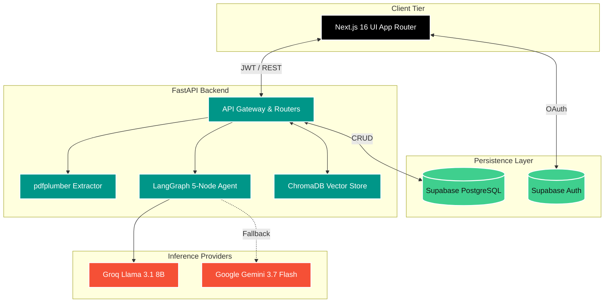

<div align="center">


# ⚡ EduForge 

**The ultimate AI-native e-learning factory.**  
*Upload a raw PDF. Get a complete, interactive, structured course in seconds.*

<h3>
  <a href="https://edu-forge-eta.vercel.app/">🔴 Try the Live Demo on Vercel</a>
</h3>

[](https://nextjs.org)
[](https://fastapi.tiangolo.com)
[](https://langchain.com)
[](https://groq.com)
[](https://supabase.com)

[Explore Features](#-the-eduforge-experience) • [View Architecture](#-system-architecture) • [Quick Start](#-quick-start) • [Tech Stack](#-the-stack)

<br/>
</div>

---

## 🔮 The Vision

Education doesn't scale when educators and students are forced to spend hundreds of hours manually parsing textbooks, organizing notes, and drafting practice questions. 

**EduForge** completely eliminates the friction of learning material preparation. Powered by a hyper-optimized **Agentic AI Pipeline** and running on **Groq's LPU Inference Engine**, EduForge ingests dense, unstructured PDFs and autonomously architects a full-fledged, highly-interactive e-learning platform specifically for that content.

<br/>

## 🚀 The EduForge Experience

### 🧠 The LangGraph AI Architect
EduForge doesn't just "summarize" documents. It runs a **5-Node Agentic Workflow** that acts as an expert curriculum designer:
- `1` **Intelligent Chunking:** Breaks down dense PDFs into semantically coherent micro-lessons.
- `2` **Topic Extraction:** Autonomously identifies core themes and learning objectives.
- `3` **Curriculum Generation:** Drafts a multi-chapter hierarchical syllabus.
- `4` **Self-Validation:** The AI critiques its own curriculum for flow, gaps, and logical progression.
- `5` **Final Polish:** Generates the polished, highly-structured final course payload.

### ⚡ Blazing Fast Generation 
Backed by **Groq (`llama-3.1-8b-instant`)** and gracefully falling back to **Google Gemini (`gemini-3.7-flash`)**, course generation feels instant. Rate limit protections, exponential backoffs, and multi-endpoint routing ensure the pipeline *never* drops a document.

### 💬 Vector-Powered Tutor (RAG)
Every generated course gets its own dedicated, context-aware AI tutor.
Powered by **ChromaDB** and `all-MiniLM-L6-v2` embeddings, the tutor achieves instant semantic recall across your textbook. Ask questions, request summaries, or have the tutor explain complex concepts like you're 5.

### 🏆 Gamified Mastery
- **Auto-Generated Quizzes:** Instantly generated multiple-choice knowledge checks per chapter.
- **Micro-Progress Tracking:** Visual progress bars track every lesson read and quiz passed.
- **Learning Analytics:** Global dashboard tracking active courses, hours learned, and study streaks.

### 💎 Premium Glassmorphism UI
An uncompromised aesthetic experience. Designed dark-first with frosted glass panels, fluid Framer Motion animations, glowing gradient accents, and immersive UI micro-interactions.

<br/>

## 🏗 System Architecture

EduForge is engineered as a robust decoupled system, communicating via REST and utilizing a shared Supabase PostgreSQL backend.



<br/>

## 🛠 The Stack

<div align="center">
  <table>
    <tr>
      <td align="center" width="25%">
        <br>
        <b>Frontend</b><br>
        Next.js 16, React 19, Framer Motion, Tailwind CSS
      </td>
      <td align="center" width="25%">
        <br>
        <b>Backend</b><br>
        FastAPI, Uvicorn, Pydantic
      </td>
      <td align="center" width="25%">
        <br>
        <b>Database & Auth</b><br>
        Supabase, PostgreSQL, JWT
      </td>
      <td align="center" width="25%">
        <br>
        <b>AI & RAG</b><br>
        LangGraph, Groq, Gemini, ChromaDB
      </td>
    </tr>
  </table>
</div>

<br/>

## 🚀 Quick Start

Get your local instance of EduForge running in under 5 minutes.

### 1. The Essentials
Ensure you have installed:
- [Node.js](https://nodejs.org/) (v18+)
- [Python](https://www.python.org/) (v3.10+)
- Accounts for [Supabase](https://supabase.com), [Groq](https://console.groq.com), and [Google AI Studio](https://aistudio.google.com).

### 2. Clone & Setup Backend

```bash
git clone https://github.com/yourusername/EduForge.git
cd EduForge/backend

# Create & activate virtual environment
python -m venv venv
source venv/bin/activate  # Windows: venv\Scripts\activate

# Install heavy dependencies
pip install -r requirements.txt
```

### 3. Environment Secrets

Create a `.env` file in the `backend/` directory:
```env
# Supabase
SUPABASE_URL=https://your_project.supabase.co
SUPABASE_ANON_KEY=your_anon_key

# The Brains (Groq is primary, Gemini is fallback)
GROQ_API_KEY=gsk_your_groq_api_key
GROQ_MODEL=llama-3.1-8b-instant

GEMINI_API_KEY=AIzaSy_your_gemini_api_key
GEMINI_MODEL=gemini-3.7-flash
```

Create `.env.local` in the project root (Frontend):
```env
NEXT_PUBLIC_SUPABASE_URL=https://your_project.supabase.co
NEXT_PUBLIC_SUPABASE_ANON_KEY=your_anon_key
NEXT_PUBLIC_API_URL=http://localhost:8000
```

### 4. Database Seeding

Run the required schema setup in your Supabase SQL Editor.
<details>
<summary><b>Click to expand SQL Schema</b></summary>

```sql
-- Core Tables
CREATE TABLE courses (
  id UUID DEFAULT gen_random_uuid() PRIMARY KEY,
  user_id UUID REFERENCES auth.users(id),
  title TEXT,
  raw_text TEXT,
  status TEXT DEFAULT 'uploaded',
  course_structure JSONB,
  created_at TIMESTAMPTZ DEFAULT now()
);

CREATE TABLE chat_history (
  id UUID DEFAULT gen_random_uuid() PRIMARY KEY,
  course_id UUID REFERENCES courses(id),
  user_id UUID REFERENCES auth.users(id),
  query TEXT,
  answer TEXT,
  created_at TIMESTAMPTZ DEFAULT now()
);

CREATE TABLE quizzes (
  id UUID DEFAULT gen_random_uuid() PRIMARY KEY,
  course_id UUID REFERENCES courses(id),
  chapter_index INTEGER,
  questions JSONB,
  created_at TIMESTAMPTZ DEFAULT now()
);

CREATE TABLE progress (
  id UUID DEFAULT gen_random_uuid() PRIMARY KEY,
  course_id UUID REFERENCES courses(id),
  user_id UUID REFERENCES auth.users(id),
  lesson_id TEXT,
  completed_at TEXT,
  UNIQUE(course_id, user_id, lesson_id)
);

-- RLS Policies
ALTER TABLE courses ENABLE ROW LEVEL SECURITY;
ALTER TABLE chat_history ENABLE ROW LEVEL SECURITY;
ALTER TABLE quizzes ENABLE ROW LEVEL SECURITY;
ALTER TABLE progress ENABLE ROW LEVEL SECURITY;
```
</details>

### 5. Ignition 

**Fire up the FastAPI Backend (Terminal 1):**
```bash
cd backend
uvicorn app.main:app --reload --host 0.0.0.0 --port 8000
```

**Fire up the Next.js Frontend (Terminal 2):**
```bash
# From project root
npm install
npm run dev
```

🎯 **Navigate to [http://localhost:3000](http://localhost:3000) and forge your first course!**

<br/>

## 📡 Core API Capabilities

EduForge is completely decoupled. Use the backend as a standalone service if you wish.

| Route | Protocol | Security | Operation |
|:---|:---:|:---:|:---|
| `/upload/` | `POST` | 🔒 JWT | Ingests PDF, extracts text, returns document ID |
| `/course/{id}/generate` | `POST` | 🔒 JWT | Triggers LangGraph Agent pipeline asynchronously |
| `/course/{id}` | `GET` | 🔒 JWT | Fetches deeply nested curriculum structure |
| `/chat/{id}` | `POST` | 🔒 JWT | ChromaDB semantic search + LLM generation (RAG) |
| `/quiz/generate/{id}/{ch}` | `POST` | 🔒 JWT | Generates distractors & questions dynamically |

<br/>

## 🤝 Forging Ahead (Roadmap)

- [ ] **Collaborative Classrooms:** Share generated courses with peers via invite links.
- [ ] **Audio-Native Learning:** Text-to-speech integration for podcast-style learning.
- [ ] **Spaced Repetition System (SRS):** Auto-schedules quiz reviews based on forgetting curves.
- [ ] **EPUB/Markdown Export:** Download your generated course offline.

<br/>

---
<div align="center">
  <b>Built with passion by the EduForge team.</b><br>
  Released under the MIT License. <br><br>
  <i>If EduForge saved you study time, consider dropping a ⭐!</i>
</div>
